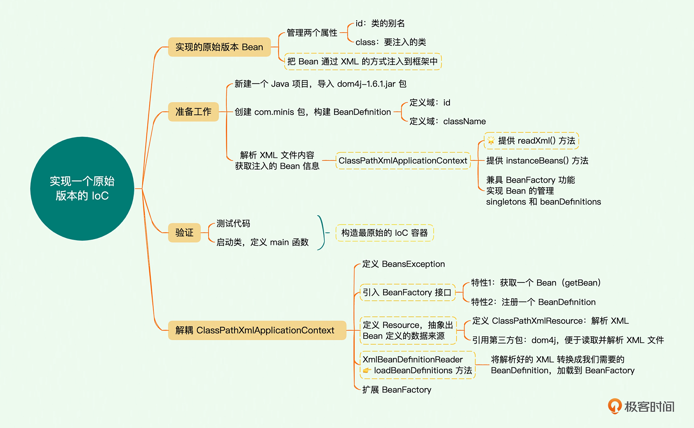
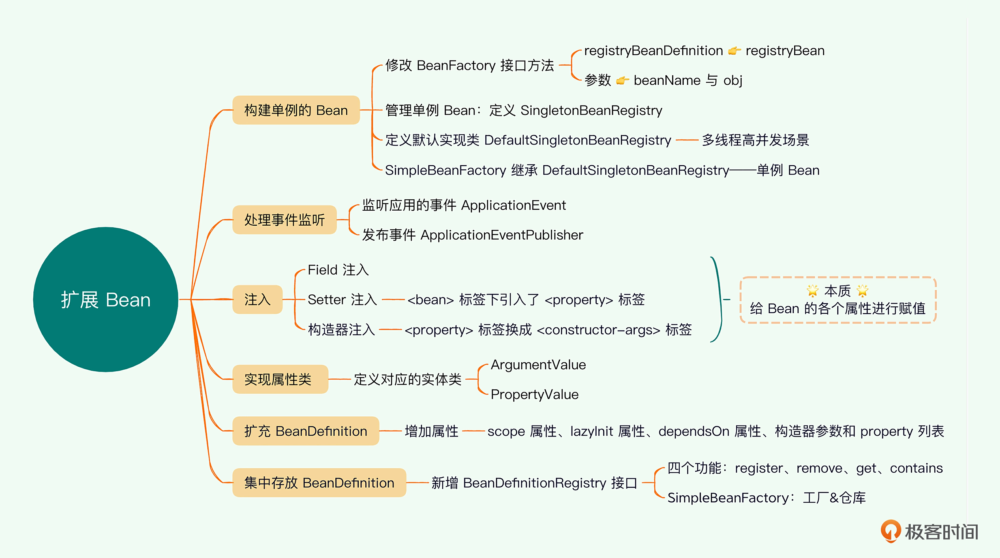

# 📔 极客时间《手写miniSpring》课程练习
## 🏖️ ioc-01
### 🧩 内容概要
#### 🏷 IoC 容器
Bean容器用来管理一个个Bean，Bean即为一个个Java的业务对象。
BeanFactory存在的意义是将创建对象与使用对象的业务代码解耦，业务开发无需关注底层对象Bean的构建和生命周期，只需专注于业务。

最原始最简单的Bean管理，可以抽象为几个简单的部件：
- 内存中的Bean映像
- 从外部获取声明的组件
  - 如xml配置信息
- 反射部件
  - 负责加载并创建实例
- 实例存储
  - 由Map保存Bean实例
- 对外开放
  - 提供 getBean() 供外部使用

#### 🏷 原始版本的IoC
1. BeanDefinition
   - Bean定义
2. 上下文 ClassPathXmlApplicationContext
   - 解析xml文件，获取Bean信息
   - 根据解析出的信息，实例化Bean
     - 通过Java反射机制，将定义信息中类名转化为实际存在的类
     - 将实例存入map中，构建与实际类的映射关系

*ClassPathXmlApplicationContext 承担了太多功能，不符合单一职责原则*

*需要将原始版本进行解耦迭代*

#### 🏷 解耦上下文 ClassPathXmlApplicationContext
**🎈 类分解**
   - 提取出核心容器
   - 将外部配置解析功能剥离
     - 当前有xml方式，后续还会有配置到web或数据库文件等，拆解后便于扩展

**🎈 具体操作步骤：**
   1. 定义异常处理类 BeansException
   2. 定义 BeanFactory 
      - 先拥有两个特性：获取一个Bean （getBean）以及注册 BeanDefinition
   3. 定义 Resource
      - 将所有外部配置信息，都当作 Resource 资源来抽象
      - 继承 Iterator 迭代器
   4. 定义 ClassPathXmlResource
      - 实现 Resource
      - 接手原 ClassPathXmlApplicationContext 中的解析xml的工作
   5. 定义 XmlBeanDefinitionReader
      - 将解析好的xml文件，转换成Bean的定义信息BeanDefinition
      - 将定义信息加载到 BeanFactory
   6. 扩展 BeanFactory 功能
      - 定义实现类 SimpleBeanFactory 实现 BeanFactory
      - 实现获取Bean的方法 getBean()，将Bean定义实例化并加载到内存中，同时对外提供获取查询
      - 实现注册BeanDefinition 方法，将Bean定义存入容器中

ClassPathXmlApplicationContext 上下文，依然是集大成者：
1. 解析xml文件中的内容
2. 加载解析的内容，构建 BeanDefinition
3. 读取 BeanDefinition 的配置信息，实例化 Bean，然后注入到 BeanFactory 容器中

而这些工作都交由专门的模块去实现并管理，功能未变，但遵循了"单一职责"原则。

### 🧩 思维导图

**❓ 思考**：控制反转，究竟“反转”了什么？如何体现在代码中的？\
**💡 答**：
1. 反转: 反转的是对Bean的控制权, 使用"new"的方式是由程序员在代码中主动控制; 使用IOC的方式是由容器来主动控制Bean的创建以及后面的DI属性注入;
2. 反转在代码中的体现: 因为容器框架并不知道未来业务中需要注入哪个Bean, 于是通过配置文件等方式告诉容器, 容器使用反射技术管理Bean的创建, 属性注入, 生命周期等.
---
## 🏖️ ioc-02
### 🧩 思维导图

**🎈 要点**
1. 增加单例Bean 的接口定义，然后把所有Bean 默认为单例模式
2. 预留事件监听的接口，方便后续进一步解耦代码逻辑
3. 扩展 BeanDefinition，添加并丰富一些属性
