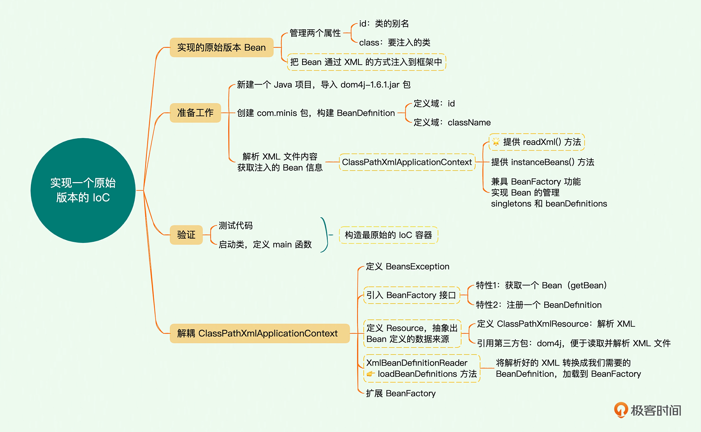

# 极客时间课程 
## 手动实现miniSpring练习
### ioc-01
思维导图

**思考**：控制反转，究竟“反转”了什么？如何体现在代码中的？\
**答**：
1. 反转: 反转的是对Bean的控制权, 使用"new"的方式是由程序员在代码中主动控制; 使用IOC的方式是由容器来主动控制Bean的创建以及后面的DI属性注入;
2. 反转在代码中的体现: 因为容器框架并不知道未来业务中需要注入哪个Bean, 于是通过配置文件等方式告诉容器, 容器使用反射技术管理Bean的创建, 属性注入, 生命周期等.