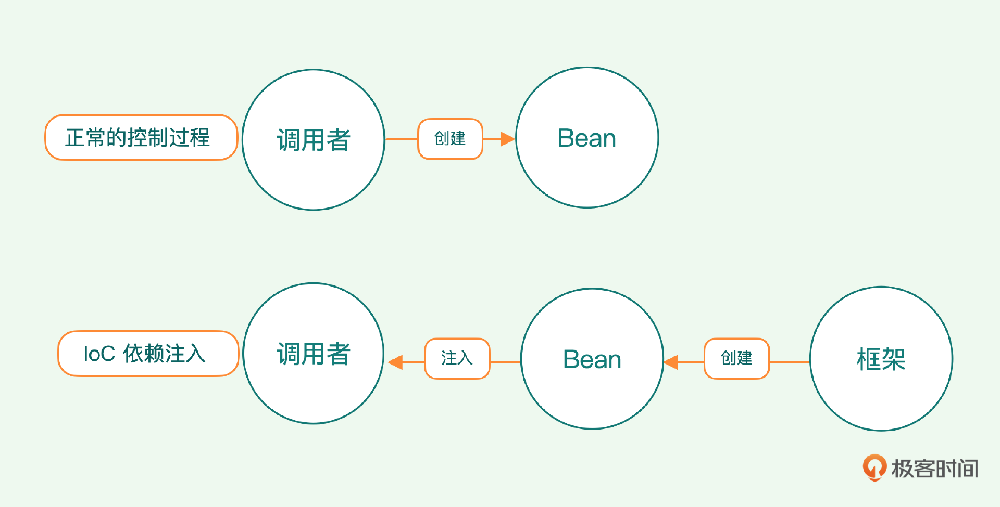
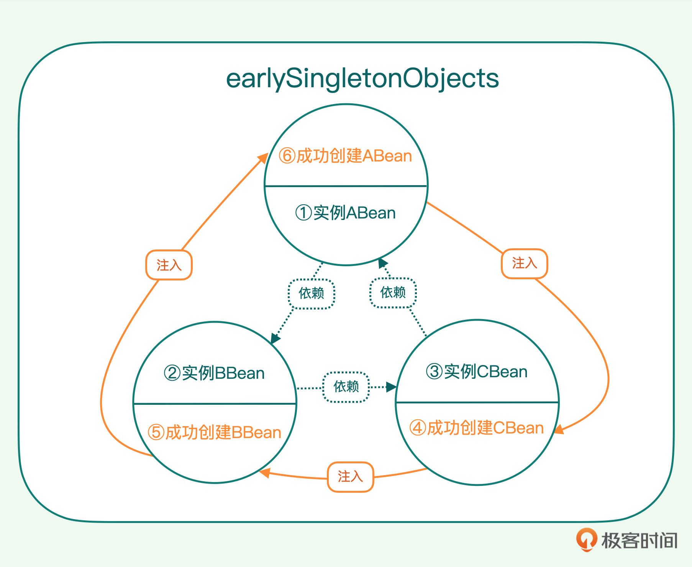

# 📔 极客时间《手写miniSpring》课程练习
## 🏖️ ioc-01
### 🧩 内容概要
#### 🏷 IoC 容器
Bean容器用来管理一个个Bean，Bean即为一个个Java的业务对象。
BeanFactory存在的意义是将创建对象与使用对象的业务代码解耦，业务开发无需关注底层对象Bean的构建和生命周期，只需专注于业务。

最原始最简单的Bean管理，可以抽象为几个简单的部件：
- 内存中的Bean映像
- 从外部获取声明的组件
  - 如xml配置信息
- 反射部件
  - 负责加载并创建实例
- 实例存储
  - 由Map保存Bean实例
- 对外开放
  - 提供 getBean() 供外部使用

#### 🏷 原始版本的IoC
1. BeanDefinition
   - Bean定义
2. 上下文 ClassPathXmlApplicationContext
   - 解析xml文件，获取Bean信息
   - 根据解析出的信息，实例化Bean
     - 通过Java反射机制，将定义信息中类名转化为实际存在的类
     - 将实例存入map中，构建与实际类的映射关系

*ClassPathXmlApplicationContext 承担了太多功能，不符合单一职责原则*

*需要将原始版本进行解耦迭代*

#### 🏷 解耦上下文 ClassPathXmlApplicationContext
**🎈 类分解**
   - 提取出核心容器
   - 将外部配置解析功能剥离
     - 当前有xml方式，后续还会有配置到web或数据库文件等，拆解后便于扩展

**🎈 具体操作步骤：**
   1. 定义异常处理类 BeansException
   2. 定义 BeanFactory 
      - 先拥有两个特性：获取一个Bean （getBean）以及注册 BeanDefinition
   3. 定义 Resource
      - 将所有外部配置信息，都当作 Resource 资源来抽象
      - 继承 Iterator 迭代器
   4. 定义 ClassPathXmlResource
      - 实现 Resource
      - 接手原 ClassPathXmlApplicationContext 中的解析xml的工作
   5. 定义 XmlBeanDefinitionReader
      - 将解析好的xml文件，转换成Bean的定义信息BeanDefinition
      - 将定义信息加载到 BeanFactory
   6. 扩展 BeanFactory 功能
      - 定义实现类 SimpleBeanFactory 实现 BeanFactory
      - 实现获取Bean的方法 getBean()，将Bean定义实例化并加载到内存中，同时对外提供获取查询
      - 实现注册BeanDefinition 方法，将Bean定义存入容器中

ClassPathXmlApplicationContext 上下文，依然是集大成者：
1. 解析xml文件中的内容
2. 加载解析的内容，构建 BeanDefinition
3. 读取 BeanDefinition 的配置信息，实例化 Bean，然后注入到 BeanFactory 容器中

而这些工作都交由专门的模块去实现并管理，功能未变，但遵循了"单一职责"原则。

### 🧩 思维导图

**❓ 思考**：控制反转，究竟“反转”了什么？如何体现在代码中的？\
**💡 答**：
1. 反转: 反转的是对Bean的控制权, 使用"new"的方式是由程序员在代码中主动控制; 使用IOC的方式是由容器来主动控制Bean的创建以及后面的DI属性注入;
2. 反转在代码中的体现: 因为容器框架并不知道未来业务中需要注入哪个Bean, 于是通过配置文件等方式告诉容器, 容器使用反射技术管理Bean的创建, 属性注入, 生命周期等.
---
## 🏖️ ioc-02
### 🧩 思维导图

**🎈 要点**
1. 增加单例Bean 的接口定义，然后把所有Bean 默认为单例模式
2. 预留事件监听的接口，方便后续进一步解耦代码逻辑
3. 扩展 BeanDefinition，添加并丰富一些属性

---
## 🏖️ ioc-03
**Java反射机制，是IoC容器的灵魂，是其赖以工作的基础。**
### 🧩 思维导图
思维导图 TODO

**🎈 关于控制反转和依赖注入**

**控制反转**是一开始的概念，即 IoC，但概念难以理解，一开始不明白到底反转了什么。

如上图，一般来说，使用一个Bean，由调用者创建（new）来使用，这是我们认为的“正常”的控制过程。
IoC正好相反，框架来创建Bean，将Bean注入到调用者的业务中使用。这个过程与“正常”过程相反，这就是控制反转的意思。

因术语过于隐晦，引发很长时间争议，直到传奇人物 Martin Fowler 提出“依赖注入”（DI），“依赖注入”成为大家最常用的术语。
其实依赖注入，是控制反转的一个具体的、常用的实现方式。控制反转是一种更为广泛的概念。

**循环依赖**

当 Spring 扫描到 ABean 时，解析它的内部属性，发现某个属性是另外一个 BBean，此时 Spring 还不存在实例 BBean，这时就要求 Spring 创建 ABean 的过程中，再去创建 BBean。
BBean 可能又会依赖第三个 CBean，而 CBean 可能会反下来依赖 ABean。这样，就形成了循环依赖。

Spring 在创建 Bean 的过程中，会根据 Bean 的定义配置生成 BeanDefinition，然后根据定义加载 Bean，然后进行实例化，最后在 Bean 中注入属性。
即在属性注入前，Bean 的实例已经生成了，只不过还不是完整的实例，很多属性没有值。而循环依赖发生在属性注入这一阶段，因此，我们可以在实例化与属性注入这两个阶段之间，将这些已创建却没有注入属性
的实例存储起来，在属性注入的时候使用。
1. 实例化 ABean，此时属性未赋值，将实例保存备用。给 ABean 注入属性，此时需要依赖 BBean。
2. 实例化 BBean，先将实例保存备用。给 BBean 注入属性，发现它依赖 CBean。
3. 实例化 CBean，先将实例保存备用。给 CBean 注入属性，发现它反过来依赖 ABean。
4. 从保存的实例容器中找到只实例化的 ABean，取出给 CBean 注入属性，此时 CBean 完成属性注入。
5. 将 CBean 注入 BBean。
6. 将 BBean 注入 ABean。完成所有 Bean 的属性注入

## 🏖️ ioc-04
注解解释时机：注解作用在实例变量上，为了生效，首先必须创建好这个对象，也就是在 createBean 之后。
